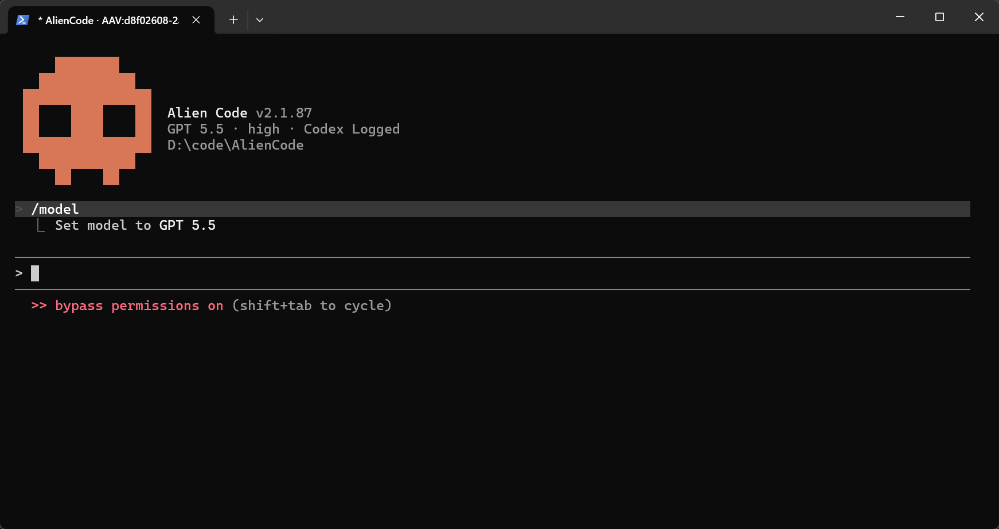

# Alien Code (acode)

<div></div>


基于 Claude Code 源码的自由构建版本，去除登录限制，内置免费模型支持，开箱即用。

---

## 特性

- **无需登录即可使用**：启动时跳过登录要求，默认完全访问权限（无需 `--dangerously-skip-permissions`）
- **内置免费模型**：未登录状态下默认使用 `minimax-m2.5-free` 等免费模型
- **OpenAI Codex 支持**：登录 OpenAI 后可使用 Codex GPT 系列模型，支持限额显示、推理动画、Token 统计与图片输入
- **多 Provider 支持**：Anthropic、OpenAI Codex、AWS Bedrock、Google Vertex AI、Anthropic Foundry
- **默认语音构建**：`VOICE_MODE` 已进入默认构建，支持 `/voice`、按键说话与听写相关界面
- **实验性功能**：54 个可用 feature flag，含 ULTRAPLAN、ULTRATHINK、BRIDGE_MODE 等
- **AGENTS.md 支持**：自动读取项目根目录的 `AGENTS.md` 作为上下文

---

## 快速开始

### Windows

```powershell
git clone https://github.com/Mycadi/AlienCode.git
cd AlienCode

# 检查 bun 版本（需要 >= 1.3.11）
bun --version

# 版本过低时重装
powershell -c "irm bun.sh/install.ps1 | iex"

# 编译
bun install
bun run compile

# Win10老系统编译
bun run compile:node

# 运行
./acode.exe
```

### macOS / Linux

```bash
git clone https://github.com/Mycadi/AlienCode.git
cd AlienCode
bun install
bun run compile
./acode
```

### bun 旧版问题排查

```bash
# 查看 bun 路径，若是 npm 安装的直接卸载
Get-Command bun
npm uninstall -g bun
```

---

## 基础使用

```bash
# 交互式 REPL（默认）
./acode

# 精简交互
./aocde --nui

# Win10 老系统启动（必须安装nodeJS，20~24版本）
./node acode.mjs

# 单次提问
./acode -p "这个目录里有什么文件？"

# 指定模型
./acode --model minimax-m2.5-free

# 从源码运行（无需编译）
bun run dev

# OAuth 登录
/login
```

---

## 免费模型

未登录状态下可用的免费模型（通过 opencode 接入）：

| 模型 | 说明 |
|---|---|
| `minimax-m2.5-free` | 未登录默认模型，综合表现最佳 |
| 其他 free 模型 | 通过 `/model` 指定 |

登录 OpenAI Codex 后，支持 `gpt-5.5`；模型选择器会显示 Codex 限额信息，无法获取时显示 `codex 限额数据暂无`。

---

## Provider 配置

| Provider | 环境变量 | 认证方式 |
|---|---|---|
| Anthropic（默认） | — | `ANTHROPIC_API_KEY` 或 OAuth |
| OpenAI Codex | `CLAUDE_CODE_USE_OPENAI=1` | OpenAI OAuth |
| AWS Bedrock | `CLAUDE_CODE_USE_BEDROCK=1` | AWS 凭证 |
| Google Vertex AI | `CLAUDE_CODE_USE_VERTEX=1` | `gcloud` ADC |
| Anthropic Foundry | `CLAUDE_CODE_USE_FOUNDRY=1` | `ANTHROPIC_FOUNDRY_API_KEY` |

---

## 构建变体

| 命令 | 输出 | 说明 |
|---|---|---|
| `bun run build` | `./acode` | 标准构建 |
| `bun run build:dev` | `./acode-dev` | 开发版本 |
| `bun run build:dev:full` | `./acode-dev` | 全量实验功能（54 个 flag） |
| `bun run compile` | `./dist/acode` | 备用输出路径 |

自定义 feature flag：

```bash
bun run ./scripts/build.ts --feature=ULTRAPLAN --feature=ULTRATHINK
```

---

## 实验性功能（`build:dev:full`）

| Flag | 说明 |
|---|---|
| `ULTRAPLAN` | 远程多 Agent 规划 |
| `ULTRATHINK` | 深度思考模式（输入 "ultrathink" 触发） |
| `VOICE_MODE` | 语音输入（默认构建已启用；运行时仍依赖 OAuth 与本地录音后端） |
| `BRIDGE_MODE` | IDE 远程控制（VS Code、JetBrains） |
| `EXTRACT_MEMORIES` | 自动记忆提取 |
| `VERIFICATION_AGENT` | 任务验证 Agent |

完整列表见 [FEATURES.md](FEATURES.md)（88 个 flag，54 个可用）。

---

## 环境变量

| 变量 | 用途 |
|---|---|
| `ANTHROPIC_API_KEY` | Anthropic API 密钥 |
| `ANTHROPIC_MODEL` | 覆盖默认模型 |
| `ANTHROPIC_BASE_URL` | 自定义 API 端点 |
| `CLAUDE_CODE_OAUTH_TOKEN` | 通过环境变量传入 OAuth token |
| `CLAUDE_CODE_USE_OPENAI` | 设为 `1` 时启用 OpenAI Codex Provider |

---

## 技术栈

| | |
|---|---|
| **运行时** | [Bun](https://bun.sh) >= 1.3.11 |
| **语言** | TypeScript |
| **终端 UI** | React + [Ink](https://github.com/vadimdemedes/ink) |
| **协议** | MCP、LSP |
| **API** | Anthropic、OpenAI Codex、AWS Bedrock、Google Vertex AI |

---

## 项目结构

```
scripts/build.ts          # 构建脚本与 feature flag 系统
src/
  entrypoints/cli.tsx     # CLI 入口
  screens/REPL.tsx        # 主交互界面
  QueryEngine.ts          # LLM 查询引擎
  commands/               # slash 命令实现
  tools/                  # Agent 工具（Bash、Read、Edit 等）
  services/api/           # API 客户端 + Codex 适配器
  services/oauth/         # OAuth 流程
  utils/model/            # 模型配置与 Provider 管理
```

---

## License

原始 Claude Code 源码归 Anthropic 所有。本项目基于其 npm 分发包中公开的源码构建，使用风险自负。
